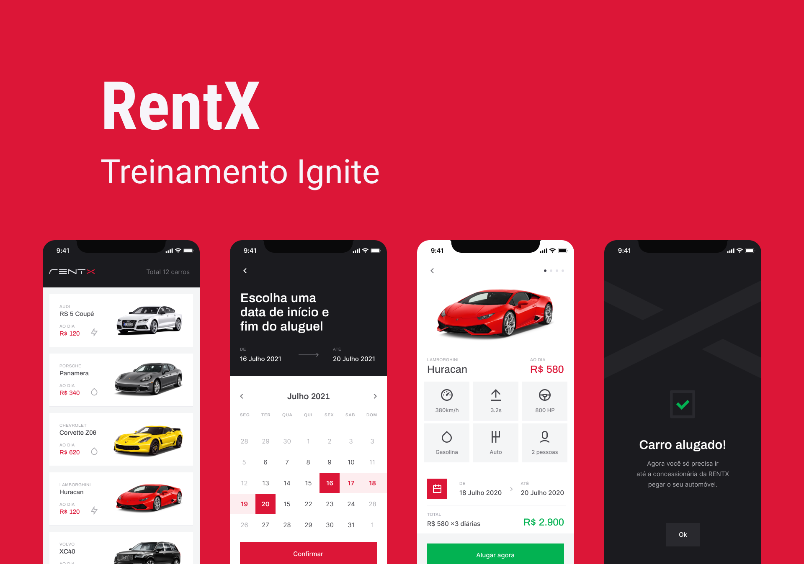

<h1 align="center">
  
</h1>

<p align="center">
  

 
 
 
</p>


## 💻 Projeto

O RentX é umn app para fazer agendamentos de carros com uma interface otimista e com implementação do conceito de Offline First.

## :hammer_and_wrench: Features

- [x] Armazenamento em banco de dados local
- [x] Offilne First 
- [x] Animações

## ✨ Tecnologias

- [x] Expo
- [x] Typescript
- [x] Axios
- [x] WatermelonDB

## Executando o projeto


```bash
# Install the dependencies
$ yarn

# Start the project
$ npx react-native run-android
```


## 🚀 Backend .env
- [rentx-backend](https://github.com/DavySz/rentx-backend)

```bash
API_URL=
```
</br>

---
<p align="center">Made with ❤️ by Davy de Souza</p>
